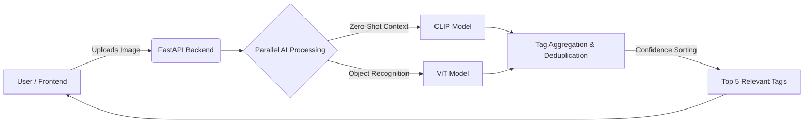

# 🧠 Visual Tagger

    

## 🚀 Overview
**Visual Tagger** is a high-performance, full-stack AI application designed to extract structured, actionable insights from images. It bridges the gap between raw visual data and structured tagging, solving the problem of manual image classification for use cases like e-commerce product labeling and security footage analysis. By leveraging a hybrid AI architecture, it provides fast, context-aware, and highly accurate image tagging, delivering immediate business value through automated visual intelligence.

## 🏗 Architecture & Pipeline



## 💻 Tech Stack

- **Core AI & Models:** Hugging Face Transformers, PyTorch, OpenAI CLIP, Vision Transformer (ViT)
- **Backend:** Python 3.10+, FastAPI, Uvicorn, Pydantic
- **Frontend:** React 18, TypeScript, Tailwind CSS, Webpack
- **Testing & Quality:** Pytest

## ✨ Key Capabilities

- **Hybrid AI Pipeline:** Runs ViT (for precise object detection) and CLIP (for zero-shot, contextual understanding) concurrently to maximize tagging accuracy.
- **Smart Aggregation Logic:** Intelligently deduplicates, filters by confidence thresholds, and sorts the combined outputs to return only the Top 5 most relevant tags.
- **Efficient Native Caching:** AI models are lazily loaded and cached in memory after the first initialization, drastically reducing latency for subsequent analysis requests.
- **Asynchronous Processing:** Built on FastAPI to handle multi-image concurrent uploads without blocking the main event loop.

## 🛠 Quick Start

To run this project locally, you'll need Python 3.10+ and Node.js installed.

**1. Clone the repository**
```bash
git clone https://github.com/yourusername/visual_tagger.git
cd visual_tagger
```

**2. Backend Setup**
```bash
cd backend/src
python -m venv venv
# Windows: venv\Scripts\activate | Mac/Linux: source venv/bin/activate
pip install -r requirements.txt
uvicorn main:app --reload
```
*(The API will be available at http://localhost:8000)*

**3. Frontend Setup**
```bash
cd ../../frontend
npm install
npm start
```
*(The UI will run on http://localhost:3000)*

## 🧠 AI Under the Hood

The architecture leverages two complimentary state-of-the-art models:
- **Vision Transformer (ViT):** Chosen for its exceptional ability to classify standard, well-defined objects natively.
- **OpenAI CLIP:** Utilized for its zero-shot capabilities. By providing contextual text prompts, CLIP can classify abstract concepts or highly specific edge-cases that a standard ImageNet-trained model might miss. 

By combining these, Visual Tagger achieves a balance between raw accuracy (ViT) and semantic flexibility (CLIP).

## 📂 Project Structure

```text
├── backend/
│   ├── src/
│   │   ├── api/           # FastAPI routers and endpoints
│   │   ├── core/          # Configuration and settings
│   │   ├── models/        # AI model singletons and loaders (ViT, CLIP)
│   │   ├── services/      # Business logic and tag aggregation
│   │   ├── utils/         # Helper functions
│   │   ├── main.py        # Application entry point
│   │   └── requirements.txt
│   └── tests/             # Pytest test suites
├── frontend/
│   ├── public/            # Static assets
│   ├── src/               # React components, hooks, and API clients
│   ├── package.json       # React dependencies
│   └── tailwind.config.js # UI styling configuration
└── README.md
```

## 🤝 Contributing & License

Contributions, issues, and feature requests are welcome! Feel free to check the issues page.
This project is licensed under the MIT License - see the `LICENSE` file for details.
